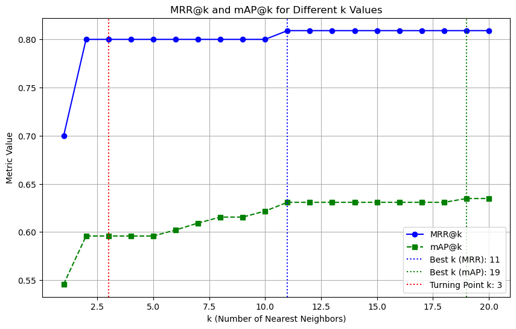

# Analysis of IronClad System Design
- **Objective**: Develop a visual identification system to verify the identity of given personnel
- **Requirements**

    1.The system should be able to identify millions of known personnel
    
    2.The system should be able to maintain a high performance despite different lighting conditions

    3.The system should be able to adjust access permissions
    * new hires
    * recent departures

    4.(Optional) The system should be able to detect non-employees

 
- **Design decisions to make**
    - Model Selection: Casia-webface or VggFace2
    - Index / Search Strategy
        - Indexing Methods: FAISS Bruteforce; FAISS HNSW; or FAISS LSH
        - Similarity Metrics: Euclidean Distance; Cosine Distance; Dot-Product Distance or Minkowski Distance
        - Number of Nearest Neighbors: Range from 1 to 20.
    - Performance Evaluation Metric
        - TP and Accuracy
        - MRR@k and mAP@k
    
    The combination of model selection, indexing methods, similarity metrics, k-nearest neighbors, and evaluation metrics directly impacts the accuracy, speed, and reliability of the face recognition system. The chosen parameters must align with the system's goals.

---

### Model Selection
- **Study Setup**

    In this study, 2 models (CASIA-WebFace and VGGFace2) are applied to generate embeddings for 100 probe images and 2265 gallery images respectively. For each model, 3 indices (BruteForce, HNSW and LSH) are built and top 20 nearest neighbors are retrieved based on euclidean metric for each index. 

    To measure the performance, the following metrics are constructed for further analysis:
    * True Positive and True Positive Rate - check if the predicted personnel is as expected.
        * These metrics can help evaluate how the model correctly detects and classifies an object when it is actually present., which is useful in IronClad where missing a detection could have consequences.
        * A model with a high TP count or Accuracy level means it is successfully identifying actual objects
    * Average distance between probe and associated gallery images.
        * A lower distance indicates better matches (higher similarity).

- **Performance result of two models (and 3 indices for each)**

    <figure>
    
    
<strong>Figure 1:</strong> <em>Model Performance</em>

    </figure>

- **Design Decision: Model VGGFace2 (with FaissHNSW for indexing)**
    - VGGFace2 models outperform Casia-WebFace models.
        - VGGFace2 have higher TP and Accuracy across all indexing approaches, even with a slightly higher distance.
        - Casia-WebFace has a lower distance, but its Accuracy and TP are much lower (worse recall).
        - A lower distance only matters if the model also has high accuracy—otherwise, it just means it confidently makes wrong matches.
    - FaissHNSW give better results for VGGFace2 and is more computationally efficient (recommended for scalability).

---

### Indexing / Search Strategy - Indexing Method
- **Study Setup**

    In this study, 3 FAISS indexing methods (Bruteforce, HNSW, and LSH) are applied with 4 similarity metrics (euclidean, cosine, dot-product and minkowski). Based on each index and metric, 20 nearest neighbors are retrieved for each of the 10 probe imags.

    Particularly, for LSH indexing, since it does not allow customized distance metric, default setting (Jaccard Similarity) is applied for indexing, and euclidean distance is applied for ranking.

    To measure the performance, two primary metrics are constructed for further analysis:

    * **Mean Reciprocal Rank at k(MRR@k)**: Measures the ranking quality of the first relevant result in top-k rankings. Higher values indicate better rankings.
    * **Mean Average Precision at k (mAP@k)**: Measures the quality of the retrieved top-k results. Higher values mean more relevant results are found within the top-k.

- **Performance Result**

    <figure>
    
    
<strong>Figure 2:</strong> <em>FAISS Indexing Performance</em>

    </figure>

- **Design Decision: FAISS HNSW Indexing**
    - HNSW provides the best performance and better timeliness in prediction.
        - Best performance in terms of mAP@k, especially with higher k = 20.
        - Similar performance as BruteForce in terms of MRR@k and mAP@k(where k < 20)
        - Expected to be faster than BruteForce: HNSW performs a graph-based approximate nearest neighbor (ANN), reducing search time to O(logN), making it a better choice for large-scale datasets (millions of embeddings)
    - LSH significantly underperforms comparing to HNSW and Bruteforce, which should be avoided in this case as accuracy is prioritized.

---

### Indexing / Search Strategy - Similarity Metric
- **Study Setup**

    Same as above. To choose the best similarity metric from Euclidean, Cosine, Dot-product and Minkowski, we will focus on the MRR@K and mAP@K for each metric across 3 indices.

- **Performance Result**

    Here the performance result shows MRR@k and mAP@k by each distance metric (for indexing and ranking)

    <figure>
    
    
<strong>Figure 3:</strong> <em>Similarity Metric Performance.</em>

    </figure>

- **Design Decision: Cosine Distance as similarity metric for indexing and ranking**
    - Cosine metric is a good choice for face recognition due to its robustness and simplicity.
        - Distance metric choice **does not significantly impact performance** in terms of MRR@k and mAP@k for this case, meaning the choice could come down to computational efficiency, interpretability, and the specific requirements of your application.
        - Cosine metric is more robust to magnitude variations (e.g., due to changes in lighting, pose, and other factors).

---

### Indexing / Search Strategy - Number of Nearest Neighbors
- **Study Setup**

    Same study setup as in "Indexing / Search Strategy - Indexing Method". For each query face, the n_nearest_neighbors=20 predictions are retrieved. 

    As HNSW indexing and Cosine distance are selected in previous steps, we are focusing on performance metrics of MRR@K and mAP@K for the top 20 nearest neighbors by "FaissHNSW_cosine_index.pkl". 
    
    With that, we will look for the best k in terms of good balance between performance and computation efficiency. 

- **Performance Result**

    <figure>
    
    
<strong>Figure 4:</strong> <em>Impact of k on Performance</em>

    </figure>

    From the figure above, we can find:
    - Both MRR@k and mAP@k increase up to k=3 and then plateau in the given case.
    - MRR@k reaches its highest value when k=11
    - mAP@k reaches its highest value when k=19

- **Design Decision: Start from k = 3 as default value for the deployed system**
    - Once the system released, it will handle millions of known personnel, instead of thousands in this case. Given the increased computation load, k can be set as 3 as default, to keep a good balance between performance and computational efficiency. However, if better accuracy are expected, k can be further increased. 