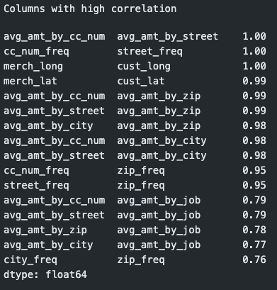
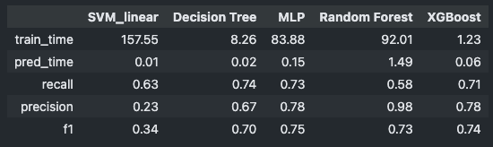
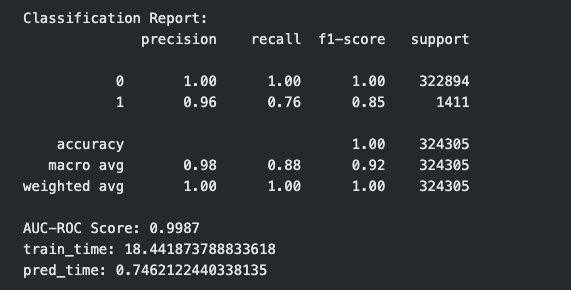
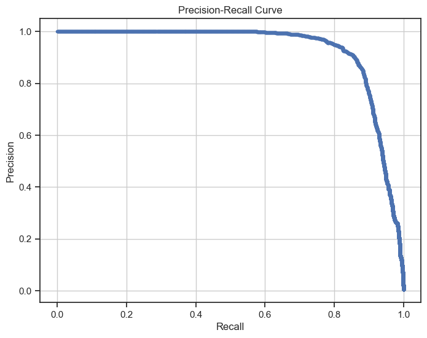

# Analysis of SecureBank System Design

**Objective**: Develop a machine learning system prototype to detect fraudulent transactions

---
### System Description
The SecureBank system leverages an ensemble model of `XGBoost` to proactively detect and prevent fraudulent financial transactions, utilizing both customer information and transaction data. 

The dataset is carefully preprocessed and partitioned to ensure high-quality inputs for reliable predictions. Among five evaluated classification models, the final model was selected based on performance metrics, with further hyperparameter tuning applied to optimize results. The evaluation results on the test set shows strong performance:

* Precision: 0.96
* Recall: 0.76
* F1-score: 0.85 for the fraud class (1)
* AUC-ROC Score: 0.9987

A Flask API was implemented to serve the system, with endpoints for data creation, model training, prediction and evaluation. Logging mechanism was applied to track execution information for continous monitoring and debugging.

---
### Data Design
**Class Distribution and Partitioning Strategies**

The class distribution is highly imbalanced, with 99.57% of of "non-fraud" case (label = 0.0) and 0.43% of frauds from input data.

In this case, it's important to apply `stratified data partitioning` when splitting the dataset into training and test sets. This ensures that each class is proportionally represented in both subsets, mirroring the original class distribution. By doing so, we avoid biased splits and obtain more reliable performance estimates during model evaluation.

**Data Preprocessing**

The preprocessing workflow began with data cleaning to standardize column formats, remove empty or duplicate rows, and ensure basic data quality. Following this, appropriate encoding strategies were applied based on the type and purpose of each feature:

1. **Identifiers**: Columns that could uniquely (or nearly) identify each entity, such as, each transaction, each customer, each merchant. 
    * `trans_num` offers no predictive value and was excluded to prevent overfitting due to memorization
    * `cc_num` and `merchant` may lead to overfitting. Useful **aggregate features**—such as transaction frequency and average transaction amount—were created instead.
    * Customer name fields (`first`, `last`) are redundant with cc_num and less relevant for fraud prediction, so they were dropped.

2. **Time and Date columns**
    * The transaction timestamp was decomposed into multiple features: hour, minute, second, day of the week, calendar date, etc.

    * These were further encoded using **cyclical encoding** to preserve their temporal nature, which helps capture periodic fraud patterns (e.g., holiday spikes).

    * An `age` feature was derived from the customer’s date of birth and the transaction time to analyze generational trends in fraud risk.

3. **Categorical columns**
    * Low-cardinality categorical variables (e.g., `sex`, `category`) were encoded using one-hot encoding.

    * High-cardinality features were transformed using **frequency encoding** to preserve distributional characteristics while managing dimensionality.

4. **Numerical columns**:
    * Features were normalized or standardized to bring them onto a comparable scale, reducing the risk of certain features disproportionately influencing the model.

**Feature Selection**

To address multicollinearity, a **correlation analysis** was conducted. Features with a high correlation coefficient (above 0.75) were removed, as excessive correlation between variables can obscure their individual contributions and lead to unstable model behavior. 

    <figure>
    
    
<strong>Figure 1:</strong> <em>Feature Correlation</em>

    </figure>

The finalized features are:

    ['sex_F', 'sex_M', 'category_ENTERTAINMENT', 'category_FOOD_DINING', 'category_GAS_TRANSPORT', 'category_GROCERY_NET',
    'category_GROCERY_POS', 'category_HEALTH_FITNESS', 'category_HOME',
    'category_KIDS_PETS', 'category_MISC_NET', 'category_MISC_POS',
    'category_PERSONAL_CARE', 'category_SHOPPING_NET',
    'category_SHOPPING_POS', 'category_TRAVEL', 'amt', 'merch_lat',
    'merch_long', 'city_pop', 'age', 'year_date', 'cc_num_freq',
    'merchant_freq', 'state_freq', 'job_freq', 'avg_amt_by_cc_num',
    'avg_amt_by_merchant', 'avg_amt_by_state', 'day_of_week_sin',
    'day_of_week_cos', 'hour_sin', 'hour_cos', 'minute_sin', 'minute_cos',
    'seconds_sin', 'seconds_cos', 'day_date_sin', 'day_date_cos',
    'month_date_sin', 'month_date_cos']

**Feature Pipeline**

Based on the processing decisions above, a standard feature pipeline was implemented to automate and enforce consistency in data transformations, which is vital for model accuracy and preventing the most common forms of **data leakage**.

The core principle to prevent leakage is: Any data transformation that learns parameters from the data (like a scaler or imputer) must be fitted only on the training dataset. By fitting the custom data transformations to sklearn pipeling, we can avoid the potential data leakage cases such as the mean value of the entire dataset is used to scale both training and test sets, which gives the model an unfair "peak" at the data it will be evlauated upon.

Together, these steps result in a clean, well-structured, and model-ready dataset optimized for performance and generalization.

---

### Model Design
**Study Setup**

In this study, 5 classification models were applied to predict for 324305 test cases. 
* SVM_linear	
* Decision Tree	
* MLP	
* Random Forest	
* XGBoost

**Metric Selection**

As mentioned above, the dataset is highly imbalanced where the non-fraud transaction takes the majority part (99.57%). In this case, the accuracy metric may not be very helpful, as a model can still achieve high accuracy rate by simply predicting the majority class (negative) all the time.

* The **recall rate** is crucial as it can measure whether a postive case is mis-predicted, and in this case, missing a positive case could be costly when a fraud is not detected.

* **Precision** is important too, as each false alert may introduce a series of actions which can be costly.

* Given the extreme imbalance situation, focusing solely on precision can lead to neglecting recall, which may result in many positive cases being missed. Therefore, a balance between precision and recall is often sought, which is why the **F1-Score** needs to be considered.

* **AUC-ROC score** is important as it evaluates the model's ability to discriminate between the two classes, regardless of the class distribution, making it ideal for imbalanced datasets.

* Additionally, metrics of `training_time` and `prediction_time` should be considered, to evaluate model execution speed for final decision.

**Model Selection**

The performance result for 5 models is as below.

    <figure>
    
    
<strong>Figure 2:</strong> <em>Model Performance</em>

    </figure>

Summary:
| Metric              | Best Model(s)            | Notes                                                                                               |
| ------------------- | ------------------------ | --------------------------------------------------------------------------------------------------- |
| **Train Time**      | **XGBoost (1.23s)**      | Fastest to train by far.                                                                            |
| **Prediction Time** | **SVM (0.01s)**          | Fastest at inference. XGBoost is also fast (0.06s).                                                 |
| **Recall**          | **Decision Tree (0.74)** | Best at finding positives. MLP (0.73) and XGBoost (0.71) are close.                                 |
| **Precision**       | **Random Forest (0.98)** | Extremely precise, likely predicting fewer positives but with high confidence.                      |
| **F1 Score**        | **MLP (0.75)**           | Best balance between precision and recall. XGBoost (0.74) and Random Forest (0.73) are also strong. |

Conclusions
* XGBoost offers excellent efficiency (fastest training and second-fastest prediction) with strong overall performance.
* MLP provides the best F1 score, indicating a great balance, but it’s slower to train and predict.
* Random Forest achieves highest precision, but low recall suggests it may be overly conservative.
* Decision Tree is simple and recall-focused, with solid precision and fast training.
* SVM (linear) performs poorly on precision/F1, despite fast prediction, and has very high training cost.

Thus, `XGBoost` is a standout choice for its combination of balanced performance and efficiency.

**Hyerparameter Tuning**

With selected `XGBoost` model, hyperparameters tuning was conducted in 5 stages to find the optimal values for:
* **n_estimators**: Number of boosting rounds (trees). More trees can increase performance but also risk overfitting.
* **max_depth**: Maximum depth of each tree. Higher values increase model complexity and risk of overfitting.
* **min_child_weight**: Minimum sum of instance weight (hessian) in a child node. Higher values make the algorithm more conservative and reduce overfitting. 
* **gamma**: Minimum loss reduction required to make a further partition. Larger values make the model more conservative. 
* **subsample**: Fraction of the training data used for growing each tree. Controls overfitting. 
* **colsample_bytree**: Fraction of features used when constructing each tree.
* **reg_alpha**: L1 regularization term on weights. Can drive feature weights to 0 for sparsity.
* **reg_lambda**: L2 regularization term on weights. Helps control model complexity.

`RandomizedSearchCV` and `GridSearchCV` are applied accordingly, as the former provides efficient search for a larger hyperparameters space and latter is better for a smaller one.

Particularly, `stratified cross-validation` strategy was applied to address data imbalance, which ensures the distribution in train and validation dataset is proportional to the original dataset. 

(Detailed tuning process can be found in "Hyperparameter Tuning" section of "securebank/notebooks/System Design Analysis.ipynb")

---
### Performance Metrics
The performance results of the tuned model is as below.

    <figure>
    
    
<strong>Figure 3:</strong> <em>Performance for XGBoost (Tuned) </em>

    </figure>

Here is a summary comparing to the untuned one:

| Metric(for class 1)| Untuned Model | Tuned Model  | Comment        |
| ------------------ | --------------| -------------|--------------------------|
| **F1 Score**       | 0.74          | 0.85         |Significant Improvement   |
| **Precision**      | 0.78          | 0.96         |Excellent Improvement     |
| **Recall**         | 0.71          | 0.76         |Modest Improvement        |
| **AUC-ROC**        | 0.95          | 0.9987       |Outstanding               |
| **Train Time (sec)**     | 1.23          | 18.44        |Increased, but still good |
| **Pred Time (sec)**      | 0.06          | 0.74         |Increased, but still good |

**Key Insights**

* **Significant Performance Boost**: You have successfully improved upon your already strong baseline. The F1-score for the positive class (class 1) jumped from 0.74 to 0.85, which is a substantial gain and the primary indicator of a successful tuning process.

* **Drastic Increase in Precision**: The most impressive gain is in precision, which leaped from 0.78 to 0.96. This means your final model is extremely reliable; when it predicts the positive class, it is correct 96% of the time. This is a critical improvement, especially if the cost of a false positive is high.

* **Outstanding Discriminatory Power**: An **AUC-ROC score of 0.9987** is nearly perfect. This indicates that your model has an almost flawless ability to distinguish between the positive (1) and negative (0) classes.

* **Handling Class Imbalance Well**: The classification report shows a significant class imbalance (322,894 negative samples vs. 1,411 positive samples). The high scores for the minority class (class 1) and the near-perfect AUC score confirm that your model has learned the patterns of the minority class effectively, rather than just defaulting to the majority class.

* **Train and Pred Time**: The execution time increased but still considered efficient operationally, making it a practical option for real-world deployment and maintenance.

A Precision-Recall Curve is generated to visualizes the trade-off between precision and recall rate.

    <figure>
    
    
<strong>Figure 3:</strong> <em>Precision-Recall Curve</em>

    </figure>

The previous test set results (Precision: 0.96, Recall: 0.76, F1: 0.85) are located in an excellent position on this curve, near the optimal balance point (the "Elbow" part). This demonstrates confidence that it is a robust and well-calibrated model. 

**Online Metrics**

Besides the performance metrics above, additional online metrics can be collected after deployment for contious monitoring and evaluation:
* **Prediction Latency**: The time it takes for the model to return a prediction after receiving a request.
    * In real-time fraud detection, predictions must be extremely fast to avoid delaying transactions and impacting the user experience. Spikes in latency need immediate attention.
* **Uptime / Availability**: The percentage of time the model's API is online and responding to requests. This is critical when high availability is critical.
* **Throughput (Requests per Second)**: The number of prediction requests the model is handling per second. This ensures the model can handle peak transaction volumns without performance degradation 
* **Error Rate**: The percentage of requests that result in an error, which evaluates the robustness of the system and model 

---
### Deployment Strategy
**Flask API**
1.  `create_dataset` function: allows administrators to generate new training datasets, with the preprocessing and selected features. Historical data is stored for debugging and periodic retraining.
2. `train_model` function: initializes the specified model type and trains it on the prepared data. 
3. Once trained, the `predict` function provides real-time prediction for online transaction data, merges it with customer information, and uses the trained model to generate predictions. 
4. `evaluate_model` function: assesses model performance, supporting easy testing and ongoing monitoring.

**Scalability Considereations**
1. **Model Expandability**: The `model` module is made to support further expansion, with placeholder of  `model_type` to incorporate different models.
2. **Model Versioning**: applied to track changes, compare performance, debug and ensure consistent performance.
3. **Model Evaluation**: applied for continuous monitoring on model performance
4. **Logging Mechanism**: integrated throughout the system to capture execution details, outputs, and errors for effective monitoring and debugging.
5. **Docker Deployment**: adopted to create immutable, portable units that can be horizontally scaled. 

Additional mechanisms can be considered for large-scale deployment
1. Feature Store
    * It's a centralized repository designed to manage, store, and serve features for machine learning models. 
    * It can act as a data management layer, which feature engineering and simplifies the process of building and deploying machine learning systems. 
2. Preload Model
    * XGBoost is fast at inference but not GPU-friendly by default. For low-latency, pre-loading the model in memory on server start can be helpful
3. Load Balancer
    * The docker unit can futher work with orchestration tools (like Kubernets, Docker Swarm, Google Cloud, etc) to automatically spin up more containers when traffic increases and balance load across insstances.

---
### Post-Deployment Monitoring

**Error Handling and Logging**

Error handling and logging are implemented in all the four endpoints in Flask service to:
1. Catch the error explicitly so it doesn't crash the server.
2. Log the error for debugging and traceability.
3. Return a clear, user-friendly error message and an appropriate HTTP status code 

A dedicated helper function is established at `modules.utils.logging.py` to ensure consistency of logging entries, including the items as below:

* 'timestamp': the timestamp of the current log
* 'endpoint': the requested endpoint,
* 'request_method': the request method ("GET" or "POST")
* 'request_data': the data from request
* 'status': request status
* 'output': request output, including outcomes and key processing info
* 'error': error message

Here is an example error log when `train_model` endpoint was requested without creating the datasets. It shows detailed error message with other exectuion details for debugging.

    {
    "timestamp": "20250630_091555",
    "endpoint": "/train_model",
    "request_method": "POST",
    "request_data": {
        "model_type": "xgboost"
    },
    "status": "failed",
    "output": null,
    "error": "Required data file X_train_path is missing or empty. Please execute `/create_dataset` endpoint."
    }

After fixing the error, the logging for successful execution is as below, which covers the detailed information for continous monitoring, such as comparison between different model types and versions by checking the model parameters.

    {
    "timestamp": "20250630_231832",
    "endpoint": "/train_model",
    "request_method": "POST",
    "request_data": {
        "model_type": "xgboost"
    },
    "status": "success",
    "output": {
        "model_id": "780ff0e6-2fbe-4f5b-b3da-d31c6c130366",
        "model_path": "/Users/JK/Dev/JHU/Class4_AI_enabled_system/Lab/kuang-jizi/securebank/storage/models/xgboost_780ff0e6-2fbe-4f5b-b3da-d31c6c130366.pkl",
        "model_params": {
        "model_type": "xgboost",
        "objective": "binary:logistic",
        "base_score": null,
        "booster": null,
        "callbacks": null,
        "colsample_bylevel": null,
        "colsample_bynode": null,
        "colsample_bytree": 0.9,
        "device": null,
        "early_stopping_rounds": 50,
        "enable_categorical": false,
        "eval_metric": "logloss",
        "feature_types": null,
        "feature_weights": null,
        "gamma": 0.4,
        "grow_policy": null,
        "importance_type": null,
        "interaction_constraints": null,
        "learning_rate": 0.02,
        "max_bin": null,
        "max_cat_threshold": null,
        "max_cat_to_onehot": null,
        "max_delta_step": null,
        "max_depth": 7,
        "max_leaves": null,
        "min_child_weight": 2,
        "missing": NaN,
        "monotone_constraints": null,
        "multi_strategy": null,
        "n_estimators": 1489,
        "n_jobs": null,
        "num_parallel_tree": null,
        "random_state": 42,
        "reg_alpha": 0.05,
        "reg_lambda": 1.5,
        "sampling_method": null,
        "scale_pos_weight": null,
        "subsample": 0.8,
        "tree_method": null,
        "validate_parameters": null,
        "verbosity": null
        },
        "X_train_path": "/Users/JK/Dev/JHU/Class4_AI_enabled_system/Lab/kuang-jizi/securebank/storage/datasets/X_train_stratified_20250630_231737.txt",
        "y_train_path": "/Users/JK/Dev/JHU/Class4_AI_enabled_system/Lab/kuang-jizi/securebank/storage/datasets/y_train_stratified_20250630_231737.txt",
        "training_duration (minutes)": 0.0,
        "timestamp": "20250630_231832"
    },
    "error": null
    }

**Concept Drift and Model Degradation**
The statistical relationship between input data and target variables may change over time (e.g. the fraud tactics may evolve), which would lead to performance degradation of the system. To address this, the following actions can be conducted:

1. **Statistical Monitoring on Data and Predictions**: measures how feature distribution changes from the training data (such as Chi-squared test).
2. **Model Performance Tracking**: continuously evaluate selected metrics: Precision, Recall, F1 score and ROC-AUC.
3. **Model Re-training**: periodically retrain models on new data, to ensure the model can capture the latest changes and establish new patterns.

### Reference
*  securebank/notebooks/System Design Analysis.ipynb - more details including source code, data points and step-by-step articulation can be found there.

